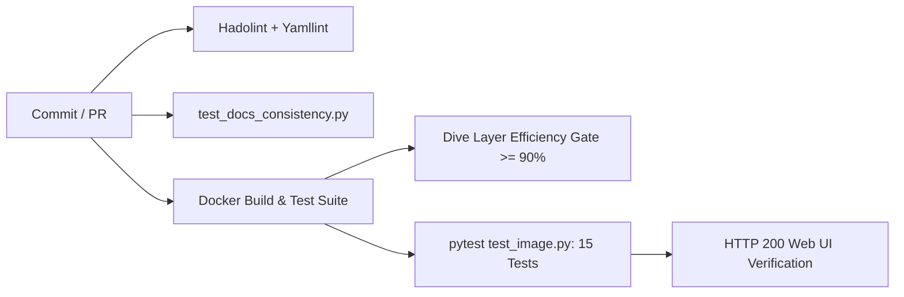

# CI/CD, Releases & Automation

This document details the automated testing, security validation, and release pipelines running in GitHub Actions for **FileFlows Real Image**.

---

## 1. Upstream-Anchored Release Versioning

Unlike conventional semantic versioning, this project's versioning is anchored directly to the upstream FileFlows release while tracking downstream build revisions:

$$\text{Release Tag} = \mathbf{v\langle\text{upstream-calver}\rangle\text{-real.}\langle\text{revision}\rangle}$$

**Example**:

- Upstream FileFlows Version: `26.09.2`
- Initial Real Image Release: `v26.09.2-real.1`
- Security update or maintenance build for the same upstream release: `v26.09.2-real.2`

### Container Image Tags

Every build automatically publishes to GitHub Container Registry (`ghcr.io/lusoris/fileflows-real-image`):

- `latest`: The newest stable release.
- `26.09.2`: The major.minor.patch release of upstream.
- `26.09.2-real.1`: Immutable tag pinned to the exact downstream build and upstream digest.

---

## 2. 24-Hour Automated Security Rebuilds

Security vulnerabilities in upstream base packages (glibc, libssl, curl) are discovered continuously. To ensure container security without waiting for upstream FileFlows releases:

1. A GitHub Actions scheduled cron runs every night at 03:00 UTC (`0 3 * * *`).
2. The workflow inspects the timestamp of the last release.
3. If &ge; 24 hours have elapsed, the workflow:
   - Re-pulls the latest Ubuntu 26.04 package repositories.
   - Re-applies all debloat and hardening optimizations.
   - Runs full image verification tests.
   - Publishes a new revision (e.g. `v26.09.2-real.2`) with patched base packages.

This ensures zero known CVEs are retained in the published image.

---

## 3. Continuous Integration Quality Gates

Every pull request and commit to `main` must pass strict quality gates defined in [`.github/workflows/ci.yml`](https://github.com/lusoris/fileflows-real-image/blob/main/.github/workflows/ci.yml):

### 1. Linting & Style

- **Hadolint**: Validates Dockerfile against container best practices.
- **Yamllint**: Enforces clean YAML syntax across workflows and compose specs.

### 2. Documentation Consistency

- **`tests/test_docs_consistency.py`**: Asserts all markdown hyperlinks resolve, YAML snippets parse, and compose examples stay synchronized with `docker-compose.yml`.

### 3. Layer Efficiency (Dive)

- Runs `wagoodman/dive` against the built container.
- CI fails if layer efficiency drops below **90%** (FileFlows Real Image scores **100%**).

### 4. Image Assertion Suite (`tests/test_image.py`)

- Verifies absence of `pebble`, `dotnet-sdk`, and `-dev` packages.
- Confirms pre-baking of `intel-media-va-driver-non-free`.
- Enforces image content size limits (&le; 650 MB).
- Boots the container and asserts HTTP 200 on port 19200 with `<title>FileFlows - Initial Configuration</title>` within 5 seconds.
