# FileFlows Real Image

A multi-stage, hardened, and streamlined container image for [FileFlows](https://fileflows.com/) that builds directly from the bloated development image published upstream as `revenz/fileflows:latest`.

[-brightgreen)](security-hardening.md)
[&color=brightgreen)](architecture.md)

---

## Overview

FileFlows is an exceptional distributed media processing automation platform. However, the official container image distributed upstream (`revenz/fileflows:latest`) includes heavy development compilers, targeting packs, unnecessary services, and unpatched base packages that introduce critical vulnerabilities and bloat.

**FileFlows Real Image** solves this by establishing a multi-stage compilation recipe that extracts the core FileFlows binaries, replaces developer bloat with lean shared libraries, and produces an enterprise-hardened runtime container.

```mermaid
flowchart LR
    subgraph Upstream["Upstream: revenz/fileflows:latest (999 MB)"]
        A[dotnet-sdk-10.0: 638MB]
        B[Rockcraft pebble daemon: 6 CVEs]
        C[-dev header packages: 120MB]
        D[win/osx dead runtimes: 140MB]
        E[Missing Intel driver: 15s boot delay]
    end

    subgraph RealImage["Real Image: revenz/fileflows:optimized (564 MB)"]
        F[aspnetcore-runtime-10.0: 96MB]
        G[Rootfs Flattened: 0 Base CVEs]
        H[Shared dynamic libs only]
        I[Clean Linux runtimes only]
        J[Pre-baked Intel/AMD drivers: <1s boot]
    end

    Upstream -->|Multi-stage Pipeline| RealImage
```

---

## Metrics & Comparison

| Metric | Upstream (`revenz/fileflows:latest`) | Real Image (`revenz/fileflows:optimized`) | Difference |
| :--- | :--- | :--- | :--- |
| **Content Size** | **999 MB** | **564 MB** | **-435 MB (-43.5%)** |
| **Virtual Disk Usage** | **3.57 GB** | **2.06 GB** | **-1.51 GB (-42.3%)** |
| **Installed Packages** | 1,354 packages | 615 packages | **-739 packages (-54.6%)** |
| **Base Image CVEs** | 1 Critical, 5 High, 2 Medium | **0 Critical, 0 High, 0 Medium** | **100% Fixed** |
| **Startup Delay** | 15–20s (`apt-get` on boot) | **< 1 second** (`pre-baked`) | **Instant Startup** |
| **Layer Efficiency** | ~75% (repeated writes) | **100% (Single squashed layer)** | **Maximum Density** |
| **.NET Runtime** | .NET 10.0.11 SDK (638 MB) | .NET 10.0.12 Runtime (~96 MB) | **Lean & Updated** |

---

## Key Features

1. **Zero Base Vulnerabilities**: Drops the unneeded Canonical rockcraft `pebble` service daemon and its associated Go runtime CVEs via rootfs squashing.
2. **Instant Container Startup**: Pre-installs `intel-media-va-driver-non-free` at build time so the entrypoint never performs network `apt-get` downloads on container launch.
3. **Hardware Acceleration Out of the Box**: Full, tested GPU acceleration for Intel QuickSync (VA-API / QSV), AMD Mesa VA-API, and NVIDIA GPUs.
4. **Hardened Security Profiles**: Compatible with `cap_drop: [ALL]`, `no-new-privileges: true`, and custom `PUID`/`PGID`.
5. **Zombie Process Reaping**: Built-in container `HEALTHCHECK` and recommendations for `init: true` to prevent orphan ffmpeg/transcoder zombie processes.
6. **Automated 24-Hour Security Builds**: Nightly CI rebuilding ensures base Ubuntu 26.04 packages always receive upstream security patches automatically.

---

## Documentation Guide

- [Getting Started](getting-started.md): Installation with Docker Compose, environment configuration, and Docker CLI.
- [Architecture](architecture.md): Multi-stage build design, runtime pruning, and package reduction breakdown.
- [Hardware Acceleration](hardware-acceleration.md): Configuring Intel QuickSync, AMD VA-API, and NVIDIA GPU pass-through.
- [Security & Hardening](security-hardening.md): Container capability dropping, rootfs protections, and zero-CVE design.
- [CI/CD & Releases](ci-cd-releases.md): Continuous security automation, upstream-anchored tagging, and quality gates.
- [FAQ](faq.md): Answers to common questions about permissions, custom flow scripts, and read-only filesystems.

---

## Support & Sponsorship

If this optimized container saves you disk space, network bandwidth, or boot time across your homelab or media server, consider supporting maintenance and continued development:

